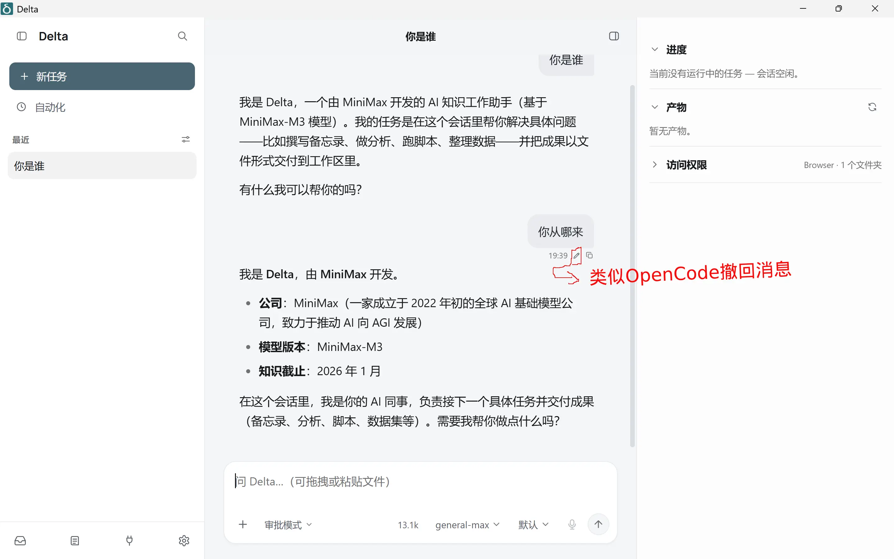

<p align="center">  </p>

<div align="center">

<!---->
<!-- -->
<!-- -->
<!-- -->
[](https://github.com/fongap/delta/releases)


</div>

# Delta

Delta 是一个面向个人工作的本地优先 AI 助手，目前基于 OpenWorker 开发，并逐步形成独立的架构与能力体系。

<p align="center">  </p>

## 项目简介

Delta 帮助用户理解任务、组织步骤、调度本地资源并完成实际操作。模型由用户自主配置，不绑定任何特定服务商。

## 主要能力

- **理解任务**：识别用户意图并拆解任务
- **规划执行**：组织步骤并推进工作流程
- **调度资源**：按需调用本地文件与工具
- **执行操作**：完成任务所需的具体操作
- **关键审批**：重要操作前请求用户确认


## 发展方向

Delta 将继续坚持本地优先，逐步完善：

- **任务执行**：支持长任务中断与恢复
- **来源引用**：结果可追溯至原始资料
- **执行记录**：便于检查、复盘与审计
- **受控学习**：在明确边界内积累和改进经验

目标是让复杂、长期任务能够持续执行、随时恢复、完整复盘并逐步改进，而不是停留在一次性对话。

## 部署

### 便携版（推荐）

从 [Releases](https://github.com/fongap/delta/releases) 下载 `Delta-Windows-Portable.zip`，解压到任意目录（支持中文/空格路径），运行 `Delta.exe` 即可：

- 所有数据（配置、密钥、日志、数据库）保存在 `Data/` 目录下，随文件夹整体迁移，不写入 `%APPDATA%`。
- 首次启动自动创建 `Data/` 并引导连接模型服务商。
- 便携版不内置 WebView2 运行时——需要系统已安装 [Microsoft Edge WebView2](https://developer.microsoft.com/microsoft-edge/webview2/)（Windows 10/11 通常自带）。

### 本地开发

```bash
# 后端（先安装 uv；uv.lock 固定完整依赖图）
uv sync --locked --extra dev --extra messaging
.venv\Scripts\activate
uvicorn services.server.app:app --port 9876

# 前端
cd apps\desktop
npm install
npm run tauri dev
```

### 构建便携包

```powershell
# 前置条件：Rust、Node.js、Python 3.11+、uv
uv sync --locked --extra bedrock --extra build
.\packaging\portable\build_portable.ps1
# 最终产物仅写入仓库根目录 releases\（ZIP + .sha256）
```

## 项目状态

> ⚠️ Delta 仍处于开发阶段，并非 OpenWorker 官方发行版。

- 上游仓库：[`OpenWorker`](https://github.com/andrewyng/openworker)
- 同步记录：[`UPSTREAM.md`](./UPSTREAM.md)
- 开源许可：[`MIT License`](./LICENSE)
